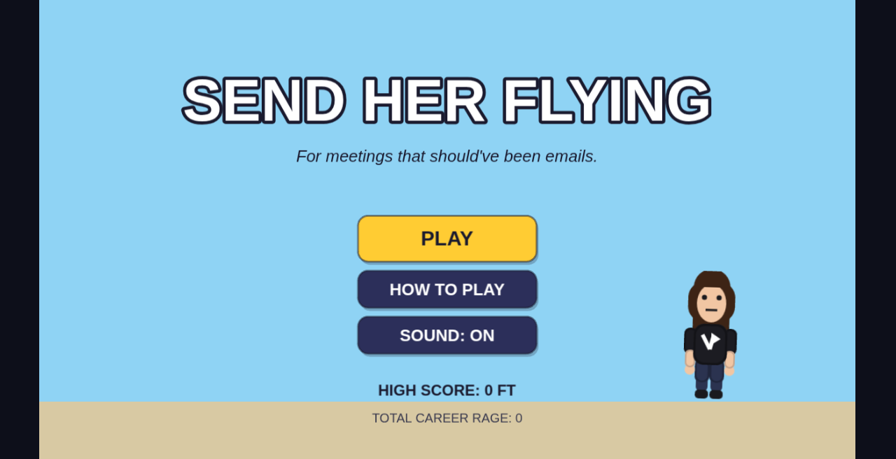
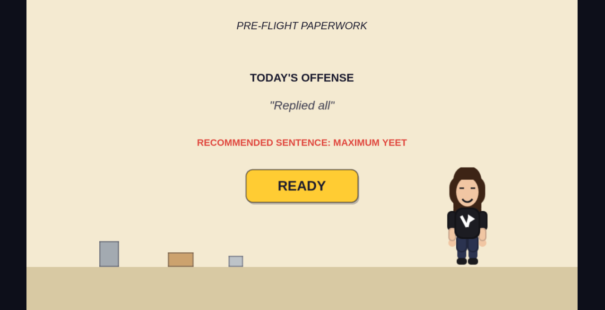
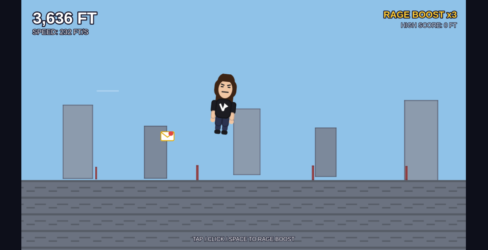
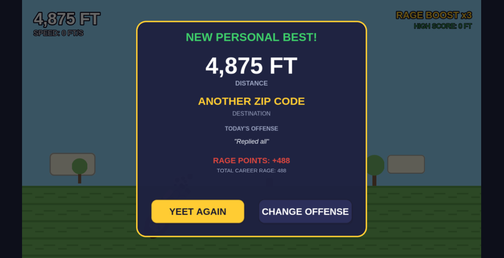

# Send Her Flying

> A cathartic office-satire arcade game — launch your least favorite coworker in a rolling chair and see how far she flies.

[**Play the live demo →**](https://yeet-her.vercel.app)



## Overview

**Send Her Flying** (repo: `yeet-her`) is a browser-based distance-launch game built for one thing: ridiculous, skillful yeets. Pick an offense ("Scheduled a 4:30 PM meeting"), charge a wobbling launch meter, release for a perfect yeet, then ride bounces and mid-air Rage Boosts through office → parking lot → city → countryside → clouds → space.

Everything — art and audio — is generated at runtime. No image packs, no sound files, no backend, no accounts. High score, career Rage Points, and sound preference live in `localStorage`.

## Highlights

- **Zero-asset pipeline** — Phaser `Graphics` baked into textures + Web Audio synthesis; ships as a pure front-end build
- **Skillful charge meter** — oscillates and speeds up near the top so a **PERFECT YEET!** needs timing, not just max hold
- **Readable flight loop** — gravity, bounce decay, and six interactive props (coffee cart, printer, mail cart, fan, Reply-All, HR couch) that help or hinder distance
- **Desktop + mobile first-class** — mouse, touch, and spacebar unified through one input layer; 1280×720 canvas with Phaser `Scale.FIT`
- **Instant restart** — charge → countdown → flight → landing runs as an in-scene state machine, so "YEET AGAIN" skips full scene teardown

## Features

- Pre-launch offense picker (presets + custom text)
- Charge meter with perfect-zone bonus and short slow-mo juice
- 3 Rage Boosts per run (forward + upward impulse)
- Distance milestones and destination buckets (Break Room → Low Earth Orbit and beyond)
- Procedural zones / parallax as you cross distance thresholds
- Floating commentary, captions, and results overlay with personal-best tracking
- Mute toggle persisted across sessions

## How to play

1. Open the [live demo](https://yeet-her.vercel.app) (or run locally — see Quick Start).
2. Choose **what she did this time**, then hit Ready.
3. **Hold** to charge. Watch the meter wobble — release in the high zone for **PERFECT YEET!**
4. After the 3-2-1 countdown, fly. **Tap / click / space** to spend Rage Boosts (3 max).
5. Hit helpful props, dodge the HR couch, bounce smartly, and land as far as you can.
6. Check destination + Rage Points, then **YEET AGAIN**.

## Controls

| Action | Input |
|---|---|
| Charge | Hold mouse / touch / **Space** |
| Launch | Release |
| Rage Boost (while airborne) | Tap / click / **Space** |
| Sound | Title-screen toggle |

## Demo

[**Play live →**](https://yeet-her.vercel.app)

| Title | Charge |
| --- | --- |
|  |  |

| Flight | Results |
| --- | --- |
|  |  |

## Quick Start

**Prerequisites:** Node.js (npm) and a modern browser.

```bash
git clone https://github.com/UribeJr/yeet-her.git
cd yeet-her
npm install
npm run dev
```

Other scripts:

```bash
npm run typecheck   # tsc --noEmit
npm run build       # typecheck + production build → dist/
npm run preview     # serve the production build locally
```

## Stack

| Layer | Choice |
|---|---|
| Language | TypeScript |
| Bundler / dev | Vite |
| Game runtime | Phaser 3 |
| Art | Procedural (`TextureFactory` / Phaser Graphics) |
| Audio | Procedural (Web Audio API) |
| Persistence | `localStorage` |
| Hosting | Vercel (`yeet-her.vercel.app`) |
| Backend | None |

## Architecture

Thin Phaser bootstrap (`src/main.ts` → `GameConfig`) loads scenes: Boot → Preload → Title → PreLaunch → Game, with How-To and Results as additive overlays.

`GameScene` owns the run as a `RunPhase` state machine (`CHARGE` → `COUNTDOWN` → `FLIGHT` → `ENDED`) so resets stay instant. Physics is computed in **feet / ft/s**; `RENDER_SCALE_PX_PER_FT` is the only feet→pixels conversion. Tunables, copy, art factory, and audio manager stay in focused modules under `src/config`, `src/content`, `src/world`, and `src/audio`.

```
src/
├── main.ts                 Phaser.Game bootstrap
├── config/                 GameConfig, Balance, Colors
├── content/strings.ts      Offenses, milestones, UI labels
├── state/                  Persistence, RunState
├── entities/               Coworker + animator
├── physics/                Flight + charge controllers
├── world/                  TextureFactory, zones, parallax
├── objects/                Interactable props + spawners
├── ui/                     HUD, meters, banners, overlays
├── input/InputManager.ts   Mouse / touch / space → one API
├── audio/AudioManager.ts   Synthesized SFX
└── scenes/                 Boot, Preload, Title, HowTo, PreLaunch, Game, Results
```

## Tweaking

Nearly every feel constant lives in **`src/config/Balance.ts`**. Start with:

- **Launch power** — `CHARGE_MIN_POWER_FT_S` / `CHARGE_MAX_POWER_FT_S`, `CHARGE_HOLD_TO_MAX_MS`
- **Perfect window** — `PERFECT_ZONE_MIN_PCT`, oscillator amplitude/frequency knobs
- **Air feel** — `GRAVITY_FT_S2`, bounce restitution + decay, `STOP_SPEED_THRESHOLD_FT_S`
- **Boosts & props** — `RAGE_BOOST_*`, `OBJECT_EFFECTS` weights/impulses
- **World bands** — `ZONE_THRESHOLDS_FT`, `DESTINATION_BUCKETS_FT`
- **Zoom only** — `RENDER_SCALE_PX_PER_FT` (does not change gameplay math)

Rough distance bands from current tuning (no boosts/objects unless noted): weak tap ~300–1000 ft, solid mid-charge ~1500–4000 ft, perfect max charge alone ~5000–7000 ft; boosts + lucky hits push into 8000–15000+ ft, with rare runs reaching "space."

## Project status

**Early / playable (v0.1.0).** Public repo with a live Vercel deploy. Core loop, procedural presentation, and local persistence are in place. A formal license is still an open item.

## License

No `LICENSE` file in the repository yet. Treat the code as source-available until a license is added — ask before redistributing.
